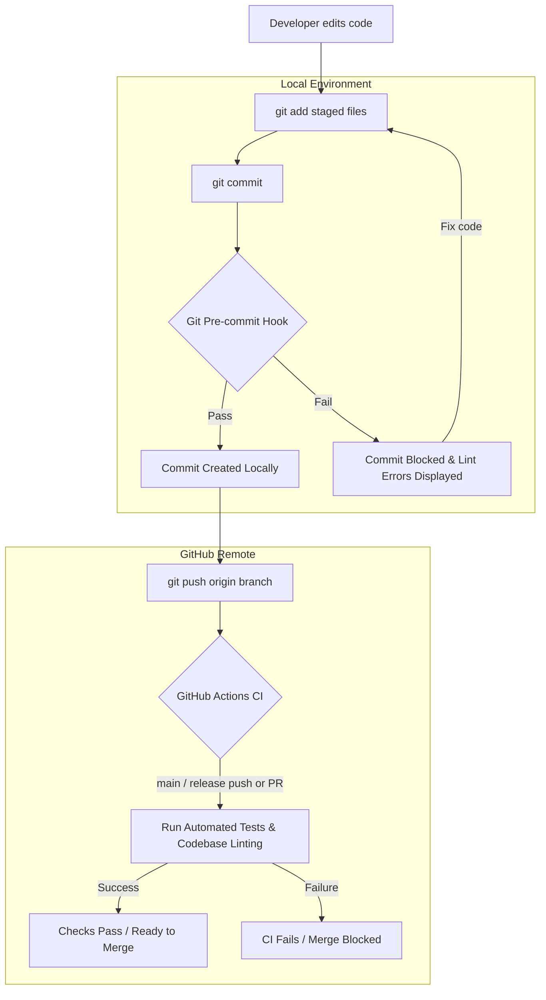

# Continuous Integration & Git Pre-commit Hooks

To ensure high software quality, prevent regressions, and avoid merge conflicts, the **TimeManagement** project employs a two-tier verification architecture:

1. **Local Git Pre-commit Hook**: Fast, client-side, read-only checks run immediately upon `git commit` to validate syntax and imports on staged files.
2. **Continuous Integration (CI) Workflow**: Remote GitHub Actions pipeline running test suites and codebase validation whenever changes are pushed to `main` or `release` branches, as well as on pull requests.



---

## 1. Continuous Integration (GitHub Actions)

A GitHub Actions Continuous Integration (CI) workflow is configured for the project repository. It automatically executes tests and verifies code integrity under the following conditions:

* **Triggers**:
  * Any `push` event to the `main` branch.
  * Any `push` event to the `release` branch.
  * Pull requests targeting `main` or `release`.
* **Automated Tasks**:
  * **Test Suite Execution**: Runs backend and module test suites to ensure existing functionality remains intact.
  * **Syntax & Import Validation**: Executes linting checks across all QML, JavaScript, and Python files to catch broken import paths, syntax errors, or unimported services.
  * **Build Integrity**: Confirms that packages build cleanly without missing dependencies or assets.
* **PR Policy**: All tests and CI checks must pass before pull requests can be reviewed and merged into protected branches.

---

## 2. Git Pre-commit Hook

Running CI on GitHub is essential, but waiting for remote checks after pushing slows down development. The local **Git pre-commit hook** runs in less than a second and catches errors right at commit time.

### Key Features
* **Staged Files Only**: Only checks files currently staged (`git add`) for commit (`.qml`, `.js`, and `.py`).
* **Read-Only**: The hook inspects files without formatting or altering them, ensuring no unexpected file mutations or merge conflicts.
* **Fast & Lightweight**: Skips cleanly if only docs, markdown, or config files are staged.
* **Emergency Bypass**: In rare emergencies where a commit must be recorded despite a lint issue, use:
  ```bash
  git commit --no-verify
  ```

---

## 3. Setup and Installation

### Prerequisites

Ensure you have the following installed on your development workstation:
* **Git**: `git --version`
* **Python 3**: `python3 --version`
* **qmllint**: Provided by Qt development packages:
  ```bash
  # Ubuntu / Debian
  sudo apt install qtdeclarative5-dev-tools
  # Or for Qt6-based environments:
  sudo apt install qml-tools
  ```

### Running the Setup Script

In the root of the project repository, run the hook setup script:

```bash
chmod +x scripts/setup_hooks.sh
./scripts/setup_hooks.sh
```

Upon success, you will see:
```text
[SUCCESS] Git pre-commit hook successfully installed at: .git/hooks/pre-commit
```

---

## 4. Verification Scripts in Detail

The verification system relies on three scripts located in the `scripts/` directory of the project:

### Script 1: `scripts/setup_hooks.sh`

This installation script writes the `.git/hooks/pre-commit` hook file and makes it executable.

```bash
#!/usr/bin/env bash
# ==============================================================================
# Git Pre-commit Hook Setup Script
# Installs local pre-commit hook to lint only staged files before committing.
# ==============================================================================

set -e

PROJECT_ROOT="$(cd "$(dirname "${BASH_SOURCE[0]}")/.." && pwd)"
HOOK_DEST="$PROJECT_ROOT/.git/hooks/pre-commit"

if [ ! -d "$PROJECT_ROOT/.git" ]; then
    echo "[ERROR] Not a git repository."
    exit 1
fi

cat << 'EOF' > "$HOOK_DEST"
#!/usr/bin/env bash
# ==============================================================================
# Git Pre-commit Hook: Lint Staged Files Only (Read-Only)
# Blocks commit if syntax or import errors are detected in staged files.
# ==============================================================================

PROJECT_ROOT="$(git rev-parse --show-toplevel)"
LINT_SCRIPT="$PROJECT_ROOT/scripts/lint.sh"

if [ ! -x "$LINT_SCRIPT" ]; then
    echo "[WARN] $LINT_SCRIPT not found or not executable. Skipping pre-commit lint."
    exit 0
fi

# Get staged QML, JS, and Python files that were added/copied/modified
STAGED_FILES=$(git diff --cached --name-only --diff-filter=ACM | grep -E '\.(qml|js|py)$' || true)

if [ -z "$STAGED_FILES" ]; then
    # No relevant files staged
    exit 0
fi

echo "[INFO] Running pre-commit syntax and import checks on staged files..."
if ! "$LINT_SCRIPT" $STAGED_FILES; then
    echo ""
    echo "[ERROR] Commit aborted: Linting errors detected in staged files."
    echo "[HINT] Fix the issues above, stage your changes, and commit again."
    echo "[HINT] Emergency bypass if required: git commit --no-verify"
    exit 1
fi
EOF

chmod +x "$HOOK_DEST"
echo "[SUCCESS] Git pre-commit hook successfully installed at: $HOOK_DEST"
```

---

### Script 2: `scripts/check_imports.py`

This standalone Python utility conducts deep validation on QML and JavaScript files. It performs four vital checks:

1. **Root Module Imports**: Verifies that `.qml` files defining visual or logical components include proper import declarations (e.g. `QtQuick` or `Lomiri`).
2. **Relative Path Resolution (QML)**: Confirms that relative files referenced in `import "path"` or `import "../path" as Alias` actually exist on disk.
3. **JavaScript Pragma Imports**: Confirms that `.import "path" as Alias` statements in `.pragma library` JavaScript files resolve to valid paths.
4. **Known Service Usage**: Detects when singleton services (such as `TimerService`, `Utils`, `Logger`, `DraftManager`, `MainModel`, `NavigationRoutes`) are invoked without being explicitly imported or declared.

```python
#!/usr/bin/env python3
"""
QML and JavaScript Import & Symbol Validator.
Validates:
1. Required module imports in .qml files (ensures file is not missing QtQuick/Lomiri).
2. Existence of relative imported files and folders (e.g. import "../../models/foo.js").
3. Usage of common namespace aliases (TimerService, Utils, Logger, etc.) without import.
"""

import sys
import os
import re

KNOWN_SERVICES = [
    "TimerService",
    "Utils",
    "Logger",
    "DraftManager",
    "MainModel",
    "NavigationRoutes"
]

def validate_file(filepath):
    errors = []
    if not os.path.isfile(filepath):
        return [f"File not found: {filepath}"]

    try:
        with open(filepath, "r", encoding="utf-8", errors="ignore") as f:
            content = f.read()
    except Exception as e:
        return [f"Could not read file: {e}"]

    file_dir = os.path.dirname(os.path.abspath(filepath))

    # Check 1: Missing base imports in .qml files
    if filepath.endswith(".qml"):
        import_lines = re.findall(r"^\s*import\s+.+$", content, re.MULTILINE)
        has_root_object = re.search(r"^\s*(?:[A-Z]\w+|Item|Rectangle|Page|Component|QtObject|Column|Row)\s*\{", content, re.MULTILINE)
        if not import_lines and has_root_object:
            errors.append("File contains QML objects but has NO import statements (missing QtQuick/Lomiri imports).")

    # Check 2: Relative file/folder imports in QML
    # Matches: import "path" or import "path" as Alias or import "../path"
    qml_imports = re.findall(r"^\s*import\s+[\"']([^\"']+)[\"'](?:\s+as\s+(\w+))?", content, re.MULTILINE)
    for rel_path, alias in qml_imports:
        target_path = os.path.normpath(os.path.join(file_dir, rel_path))
        if not os.path.exists(target_path):
            errors.append(f"Import path not found: \"{rel_path}\" (resolved to: {target_path})")

    # Check 3: Relative .import in JavaScript files (.pragma library)
    # Matches: .import "path" as Alias
    js_imports = re.findall(r"^\s*\.import\s+[\"']([^\"']+)[\"']\s+as\s+(\w+)", content, re.MULTILINE)
    for rel_path, alias in js_imports:
        target_path = os.path.normpath(os.path.join(file_dir, rel_path))
        if not os.path.exists(target_path):
            errors.append(f"JS pragma import not found: \"{rel_path}\" (resolved to: {target_path})")

    # Check 4: Unimported service aliases
    for service in KNOWN_SERVICES:
        # Check if service is called (e.g. TimerService.start())
        if re.search(r"\b" + service + r"\.", content):
            # Check if imported in QML or JS
            qml_alias = re.search(r"import\s+.*?as\s+" + service + r"\b", content)
            js_alias = re.search(r"\.import\s+.*?as\s+" + service + r"\b", content)
            # Or defined in the file itself (e.g. var TimerService = ...)
            local_decl = re.search(r"\b(?:var|let|const|function|property\s+var)\s+" + service + r"\b", content)
            if not qml_alias and not js_alias and not local_decl:
                # Exclude file if it's the actual implementation file of that service
                base_name = os.path.splitext(os.path.basename(filepath))[0]
                if base_name.lower() not in service.lower():
                    errors.append(f"Identifier \"{service}\" is used, but missing \"import ... as {service}\"")

    return errors

def main():
    if len(sys.argv) < 2:
        print("Usage: check_imports.py <file1> [file2...]")
        sys.exit(1)

    has_errors = False
    for filepath in sys.argv[1:]:
        if not filepath.endswith((".qml", ".js")):
            continue
        errs = validate_file(filepath)
        if errs:
            has_errors = True
            print(f"[FAIL] Import check failed in {filepath}:")
            for err in errs:
                print(f"  - {err}")

    if has_errors:
        sys.exit(1)
    sys.exit(0)

if __name__ == "__main__":
    main()
```

---

### Script 3: `scripts/lint.sh`

The primary test runner called by the pre-commit hook and CI pipelines. It executes:
* `qmllint` with appropriate import include flags (`-I qml -I models -I qml/components/system`).
* `scripts/check_imports.py` on QML and JavaScript files.
* `python3 -m py_compile` for Python syntax verification.

```bash
#!/usr/bin/env bash
# ==============================================================================
# Local Linting & Syntax Verification Script
# Read-only verification for QML, JavaScript, and Python files.
# Never modifies files or causes merge conflicts.
# ==============================================================================

set -o pipefail

# Text formatting
if [ -t 1 ]; then
    BOLD="\033[1m"
    GREEN="\033[32m"
    RED="\033[31m"
    YELLOW="\033[33m"
    BLUE="\033[34m"
    RESET="\033[0m"
else
    BOLD=""
    GREEN=""
    RED=""
    YELLOW=""
    BLUE=""
    RESET=""
fi

PROJECT_ROOT="$(cd "$(dirname "${BASH_SOURCE[0]}")/.." && pwd)"
cd "$PROJECT_ROOT"

ERRORS=0
CHECKED=0
FAILED_FILES=()

# Check for qmllint
if ! command -v qmllint &> /dev/null; then
    echo -e "${RED}[ERROR] 'qmllint' is not installed or not in PATH.${RESET}"
    echo "Install it via your Qt/Ubuntu development packages (e.g. qtdeclarative5-dev-tools or qml-tools)."
    exit 1
fi

IMPORT_CHECKER="$PROJECT_ROOT/scripts/check_imports.py"

lint_qml_js() {
    local file="$1"
    ((CHECKED++))
    local file_failed=0

    # 1. Grammar & Bracket Syntax check via qmllint
    local qml_out
    qml_out=$(qmllint -I qml -I models -I qml/components/system "$file" 2>&1)
    local qml_status=$?
    if [ $qml_status -ne 0 ] || [ -n "$qml_out" ]; then
        echo -e "${RED}[FAIL] Syntax Error:${RESET} $file"
        if [ -n "$qml_out" ]; then
            echo "$qml_out" | sed 's/^/  /'
        fi
        file_failed=1
    fi

    # 2. Deep Import & Symbol validation via check_imports.py
    if [ -x "$IMPORT_CHECKER" ]; then
        local imp_out
        imp_out=$("$IMPORT_CHECKER" "$file" 2>&1)
        local imp_status=$?
        if [ $imp_status -ne 0 ]; then
            echo -e "${RED}[FAIL] Import Error:${RESET} $file"
            if [ -n "$imp_out" ]; then
                echo "$imp_out" | sed 's/^/  /'
            fi
            file_failed=1
        fi
    fi

    if [ $file_failed -eq 1 ]; then
        ((ERRORS++))
        FAILED_FILES+=("$file")
    fi
}

lint_python() {
    local file="$1"
    ((CHECKED++))
    local output
    output=$(python3 -m py_compile "$file" 2>&1)
    local status=$?
    if [ $status -ne 0 ]; then
        echo -e "${RED}[FAIL] Python Syntax Error:${RESET} $file"
        if [ -n "$output" ]; then
            echo "$output" | sed 's/^/  /'
        fi
        ((ERRORS++))
        FAILED_FILES+=("$file")
    fi
}

echo -e "${BOLD}${BLUE}[INFO] Starting codebase linting...${RESET}\n"

# If specific files were passed as arguments, check only those
if [ "$#" -gt 0 ]; then
    for file in "$@"; do
        if [ ! -f "$file" ]; then
            echo -e "${YELLOW}[WARN] Skipping non-existent file: $file${RESET}"
            continue
        fi

        case "$file" in
            *.qml|*.js)
                lint_qml_js "$file"
                ;;
            *.py)
                lint_python "$file"
                ;;
            *)
                # Non-lintable file, skip silently
                ;;
        esac
    done
else
    # Full codebase scan (excluding build, .git, .clickable, .agent)
    while IFS= read -r -d '' file; do
        lint_qml_js "$file"
    done < <(find qml models -type f \( -name "*.qml" -o -name "*.js" \) -not -path "*/build/*" -print0)

    while IFS= read -r -d '' file; do
        lint_python "$file"
    done < <(find . -maxdepth 2 -type f -name "*.py" -not -path "*/build/*" -not -path "*/.git/*" -not -path "*/.clickable/*" -not -path "*/.agent/*" -print0)
    
    if [ -d "src" ]; then
        while IFS= read -r -d '' file; do
            lint_python "$file"
        done < <(find src -type f -name "*.py" -not -path "*/__pycache__/*" -print0)
    fi
fi

echo ""
echo "------------------------------------------------------------"
if [ $ERRORS -eq 0 ]; then
    echo -e "${GREEN}${BOLD}[SUCCESS] All $CHECKED files passed syntax and import validation.${RESET}"
    exit 0
else
    echo -e "${RED}${BOLD}[ERROR] Linting failed: $ERRORS error(s) found across $CHECKED checked files.${RESET}"
    echo -e "${RED}Failed files:${RESET}"
    for failed in "${FAILED_FILES[@]}"; do
        echo -e "  - $failed"
    done
    exit 1
fi
```

---

## 5. Manual Execution

You can run linting checks locally at any time without triggering a commit:

### Lint Specific Files
```bash
./scripts/lint.sh qml/Main.qml src/backend.py
```

### Lint the Entire Codebase
```bash
./scripts/lint.sh
```

### Validate Imports Directly
```bash
python3 scripts/check_imports.py qml/Main.qml models/TaskModel.js
```

---

## 6. Troubleshooting

> [!WARNING]
> If `qmllint` is missing, `scripts/lint.sh` will exit with an error. Ensure you install `qtdeclarative5-dev-tools` (or equivalent Qt development package) on your Linux machine.

* **Hook does not execute upon `git commit`**:
  Check that `.git/hooks/pre-commit` exists and has execute permissions:
  ```bash
  chmod +x .git/hooks/pre-commit
  ```
* **Linting failed on staged files**:
  Read the error message output carefully. Fix the syntax or missing import, stage the corrected files with `git add`, and repeat `git commit`.
* **Emergency bypass**:
  If you must commit while an issue is being resolved offline, append `--no-verify`:
  ```bash
  git commit -m "WIP: emergency fix" --no-verify
  ```
  Note that remote CI will still run and block merge into `main` and `release` branches until all checks succeed.
