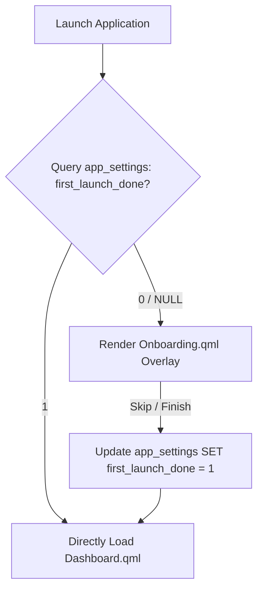

# Onboarding Technical Reference

This page describes the onboarding flow sequence presented during the first execution of the application, including persistence state flags and quick skip triggers.

## Codebase Map

| Layer | Path | Purpose |
|---|---|---|
| **Flow Coordinator** | `qml/TSApp.qml` | Detects onboarding status and renders overlay |
| **State Storage** | `models/database.js` | Database initialization setting verification |

### What actually happens

* **State Initialization**: The database structure is initialized automatically on app boot using `models/dbinit.js`.
* **First-Time Configuration**: If the user has no accounts set up, they configure their Odoo connection directly through the standard account creation page at `qml/features/settings/pages/Account_Page.qml`.

## Onboarding Execution Flow



## Settings Schema Flag

The onboarding state persists in `app_settings`:

```sql
SELECT value FROM app_settings WHERE key = 'first_launch_done';
```

* If `value` is not `1`, the application locks general navigation and redirects the active viewport to the onboarding carousel.
* Completing the onboarding screens automatically updates this key to `1` so subsequent launches bypass the sequence.
* Users can manually reset this setting via the System Settings page to re-trigger onboarding.
