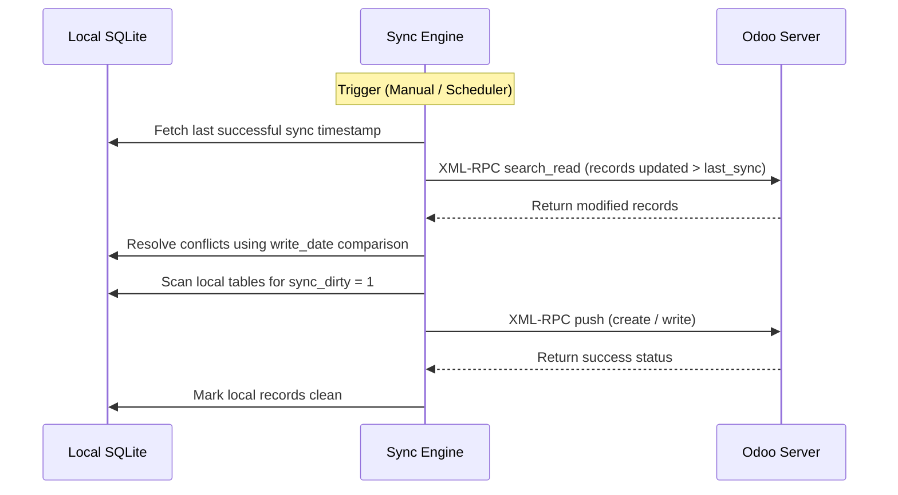

# Sync & Accounts Technical Reference

This module oversees multi-instance Odoo configuration, manual and scheduler-driven background synchronization, success/failure status messaging, and schema integrity constraints.

## Codebase Map

| Layer | Path | Purpose |
|---|---|---|
| **Frontend UI** | `qml/features/settings/` | Account configuration, sync status status indicators, and logs |
| **State & Logic** | `models/accounts.js` | Account creation, verification, and credentials checking |
| **Sync Manager** | `src/daemon.py` | Main event loops scheduling synchronization |
| **Pull Sync Engine** | `src/sync_from_odoo.py` | Sync worker querying Odoo XML-RPC endpoints |
| **Push Sync Engine** | `src/sync_to_odoo.py` | Sync worker pushing dirty records back |
| **Network Client** | `src/odoo_client.py` | XML-RPC client connection wrapper |

## Database Schema

Local account configurations and synchronization logs are stored in:

### `users`
* `id` (INTEGER, Primary Key): Local user account sequence.
* `name` (TEXT): Unique instance name identifier.
* `url` (TEXT): Server URL.
* `db` (TEXT): Odoo database identifier.
* `username` (TEXT): Username / Email.
* `password` (TEXT): Encrypted user token / password.

### `sync_report`
* `id` (INTEGER, Primary Key): Log identifier.
* `sync_time` (TEXT): Timestamp of the synchronization execution.
* `status` (TEXT): Status message (`SUCCESS`, `FAILED`).
* `details` (TEXT): Exception trace or syncing summary details.

---

## Detailed Sync Mechanism

The synchronization engine implements a robust timeline-aware conflict resolution pattern.

### Conflict Resolution Strategy
* If a record was modified both locally and on the server since the last sync, timestamps (`write_date` from Odoo vs local `update_time`) are evaluated.
* The newer timestamp wins by default. If timestamps are identical or ambiguous, the user is prompted with a conflict resolution dialog to choose which version to retain.

---

The sync functions are defined as standard Python functions in the backend files and invoked directly from the QML interface via PyOtherSide.

These functions are located in the following Python files:
* **Core Backend Interface**: `src/backend.py`
* **Settings Database Configuration**: `src/config.py`

Where the logic is defined:
* `start_sync_in_background(settings_db, account_id)` (in `src/backend.py`): Called by QML to manually run the sync worker in a background thread.

The status and execution metadata are tracked directly inside the database settings using:
* `get_account_sync_settings(db_path, account_id)` (in `src/config.py`): Loads synchronization intervals, direction preferences, and the `last_synced_at` timestamp.
* `update_last_synced_at(db_path, account_id)` (in `src/config.py`): Updates the last sync timestamp in the `users` SQLite table.
* `check_server_reachability(url, timeout)` (in `src/backend.py`): Validates if the target server is alive.
* `fetch_databases(url)` (in `src/backend.py`): Fetches the list of databases available at the target URL.
* `login_odoo(selected_url, username, password, selected_db)` (in `src/backend.py`): Logs in to Odoo via XML-RPC to validate user credentials and db configuration.
