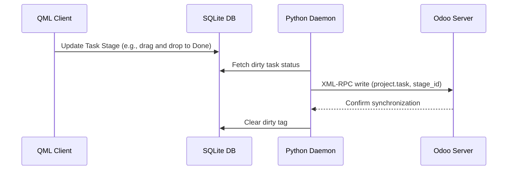

# Tasks Module Technical Reference

The Tasks Module manages work tasks, parent-child task relations, stage/Kanban state alignment, assignees, deadlines, and scheduling.

## Codebase Map

| Layer | Path | Purpose |
|---|---|---|
| **Frontend UI** | `qml/features/tasks/` | Task lists, details, editing, and kanban views |
| **State & Logic** | `models/task.js` | JS task model, stage transition logic, and filters |
| **Backend Service** | `src/sync_to_odoo.py` | Sync worker pushing task updates and scheduling changes |
| **D-Bus Interface** | `src/backend.py` | D-Bus methods for task mutations and retrieval |

## Database Schema

Tasks and assignees are stored locally in the following SQLite tables:

### `project_task_app`
* `id` (INTEGER, Primary Key): Unique Task ID.
* `name` (TEXT): Task name.
* `project_id` (INTEGER): References parent project.
* `parent_id` (INTEGER): References parent task (for nested sub-tasks).
* `date_deadline` (TEXT): Task deadline date (YYYY-MM-DD).
* `description` (TEXT): Detailed task descriptions (supports HTML).
* `stage_id` (INTEGER): References `project_task_type_app`.
* `favorite` (INTEGER): Favorite status indicator.
* `planned_hours` (REAL): Estimated hours.
* `user_ids` (TEXT): JSON array of assignee user IDs.

### `project_task_assignee_app`
Maps task assignees to res_users.
* `task_id` (INTEGER): References task.
* `user_id` (INTEGER): References instance user.

### `project_task_type_app`
Stores task stages (Kanban stages).
* `id` (INTEGER, Primary Key): Task stage ID.
* `name` (TEXT): Stage name (e.g. To Do, In Progress, Done).

---

## Sync Mechanism & Network Protocol

### Odoo XML-RPC Model Mapping
* **Remote Model**: `project.task` (Task entity), `project.task.type` (Task stages)
* **Sync Direction**: Bidirectional.

---

The frontend queries and updates tasks directly in the local SQLite database using functions defined in:

Path: `models/task.js`

Where the logic is defined:
* `getTasksForAccount(accountId)`: Returns tasks associated with a given account.
* `getAllTasksForAccount(accountId)`: Retrieves all tasks.
* `getAllTasksForAccountPaginated(accountId, limit, offset, dateFilter)`: Paginated task loader for infinite scroll.
* `updateTaskStage(taskId, stageOdooRecordId, accountId)`: Transitions a task's regular stage.
* `updateTaskPersonalStage(taskId, personalStageOdooRecordId, accountId)`: Transitions a task's personal/user stage.
* `saveOrUpdateTask(data)`: Creates/saves a new task record in SQLite if the `record_id` property is not supplied in the input `data` object.
* `saveOrUpdateTask(data)` or `edittaskData(data)`: Handles task modifications including rescheduling/updating the `deadline` column of the task record.
