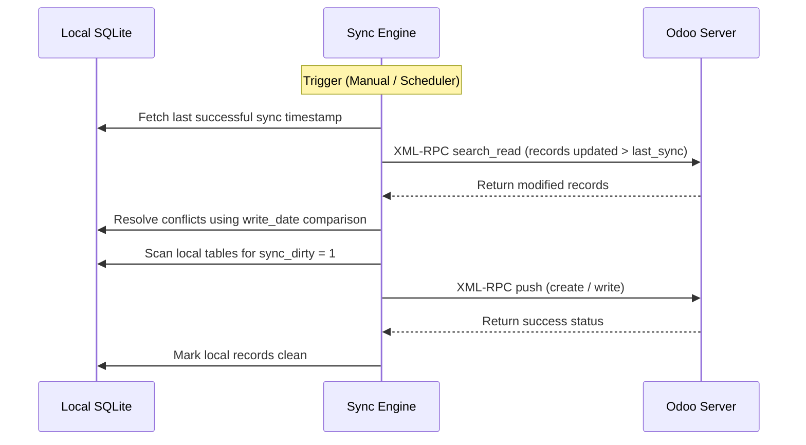

# Technische referentie voor synchronisatie en accounts

Deze module houdt toezicht op de Odoo-configuratie met meerdere exemplaren, handmatige en plannergestuurde achtergrondsynchronisatie, berichten over de succes-/mislukkingsstatus en beperkingen op de schema-integriteit.

## Codebase-kaart

| Laag | Pad | Doel |
|---|---|---|
| **Frontend-UI** | `qml/features/settings/` | Accountconfiguratie, statusindicatoren voor synchronisatiestatus en logboeken |
| **State & Logica** | `models/accounts.js` | Account aanmaken, verifiëren en inloggegevens controleren |
| **Synchronisatiebeheer** | `src/daemon.py` | Synchronisatie van hoofdgebeurtenislussen plannen |
| **Pull-synchronisatie-engine** | `src/sync_from_odoo.py` | Synchronisatiewerker die Odoo XML-RPC-eindpunten opvraagt ​​|
| **Push-synchronisatie-engine** | `src/sync_to_odoo.py` | Synchronisatiewerker duwt vuile records terug |
| **Netwerkclient** | `src/odoo_client.py` | XML-RPC-clientverbindingswrapper |

## Databaseschema

Lokale accountconfiguraties en synchronisatielogboeken worden opgeslagen in:

### `users`
* `id` (INTEGER, Primaire sleutel): Volgorde van lokale gebruikersaccounts.
* `name` (TEXT): Unieke instantienaam-ID.
* `url` (TEKST): Server-URL.
* `db` (TEXT): Odoo-database-ID.
* `username` (TEKST): Gebruikersnaam / E-mailadres.
* `password` (TEXT): Gecodeerd gebruikerstoken/wachtwoord.

### `sync_report`
* `id` (INTEGER, primaire sleutel): log-ID.
* `sync_time` (TEXT): Tijdstempel van de uitvoering van de synchronisatie.
* `status` (TEKST): Statusbericht (`SUCCESS`, `FAILED`).
* `details` (TEXT): Uitzonderingstracering of samenvattingsgegevens van synchronisatie.

---

## Gedetailleerd synchronisatiemechanisme

De synchronisatie-engine implementeert een robuust tijdlijnbewust conflictoplossingspatroon.

### Strategie voor conflictoplossing
* Als een record zowel lokaal als op de server is gewijzigd sinds de laatste synchronisatie, worden tijdstempels (`write_date` van Odoo versus lokaal `update_time`) geëvalueerd.
* De nieuwere tijdstempel wint standaard. Als tijdstempels identiek of dubbelzinnig zijn, wordt de gebruiker via een dialoogvenster voor conflictoplossing gevraagd te kiezen welke versie hij wil behouden.

---

De synchronisatie-functies zijn gedefinieerd als standaard Python-functies in de backend-bestanden en worden rechtstreeks vanuit de QML-interface aangeroepen via PyOtherSide.

Deze functies bevinden zich in de volgende Python-bestanden:
* **Core Backend-interface**: `src/backend.py`
* **Configuratie van de instellingendatabase**: `src/config.py`

Waar de logica is gedefinieerd:
* `start_sync_in_background(settings_db, account_id)` (in `src/backend.py`): Aangeroepen door QML om de synchronisatiewerker handmatig uit te voeren in een achtergrond-thread.

De status- en uitvoeringsmetagegevens worden rechtstreeks bijgehouden in de database-instellingen met behulp van:
* `get_account_sync_settings(db_path, account_id)` (in `src/config.py`): Laadt synchronisatie-intervallen, voorkeuren voor synchronisatierichting en de `last_synced_at`-tijdstempel.
* `update_last_synced_at(db_path, account_id)` (in `src/config.py`): Werkt de tijdstempel van de laatste synchronisatie bij in de SQLite-tabel `users`.
* `check_server_reachability(url, timeout)` (in `src/backend.py`): Valideert of de doelserver bereikbaar is.
* `fetch_databases(url)` (in `src/backend.py`): Haalt de lijst op met databases die beschikbaar zijn op de doel-URL.
* `login_odoo(selected_url, username, password, selected_db)` (in `src/backend.py`): Logt in op Odoo via XML-RPC om de gebruikersgegevens en de databaseconfiguratie te valideren.
